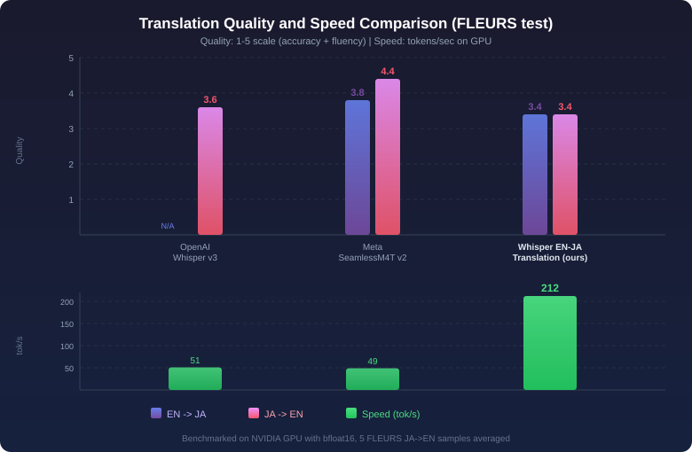

# Whisper JA-EN Speech Translation

Bidirectional speech translation between Japanese and English, built on a distilled [Whisper large-v2](https://huggingface.co/openai/whisper-large-v2) architecture.

| Direction | Input | Output |
|-----------|-------|--------|
| EN -> JA | English audio | Japanese text |
| JA -> EN | Japanese audio | English text |

## Model Details

### Architecture

This model is a **distilled** variant of [OpenAI Whisper large-v2](https://huggingface.co/openai/whisper-large-v2):

| Component | Details |
|-----------|---------|
| Base architecture | Whisper large-v2 (distilled) |
| Encoder layers | 32 (full, unchanged from large-v2) |
| Decoder layers | 4 (reduced from 32) |
| Hidden size (d_model) | 1280 |
| Vocabulary size | 51,865 |
| Mel spectrogram bins | 80 |
| Max audio length | 30 seconds |
| Max output tokens | 448 |
| Total parameters | ~756M |

The distilled architecture keeps the full 32-layer encoder for strong audio understanding while reducing the decoder from 32 to 4 layers for faster inference. This makes the model significantly faster than the full Whisper large-v2 while preserving translation quality.

### Training

The model was fine-tuned for bidirectional speech translation (EN<->JA) using paired audio-text translation data in both directions.

**Training methodology:**

- **Task**: Speech translation (`task="translate"`)
- **Encoder**: Frozen during training (pre-trained representations preserved)
- **Decoder**: Fine-tuned for translation output
- **Optimizer**: AdamW
- **Learning rate**: 2e-4 with cosine-with-restarts scheduler
- **Epochs**: 20
- **Batch size**: 72
- **Label smoothing**: 0.1
- **Gradient checkpointing**: Enabled
- **Audio filtering**: Minimum 2 seconds duration
- **Text normalization**: Applied during training (Japanese Kanji normalization, punctuation handling)

### How Translation Direction Works

Whisper's original `translate` task always outputs English. This model extends that capability by fine-tuning on **bidirectional** translation pairs, so the `translate` task can produce either Japanese or English depending on the source language token.

The translation direction is controlled via `forced_decoder_ids`:

- `language="en"` + `task="translate"` = EN audio -> **JA text**
- `language="ja"` + `task="translate"` = JA audio -> **EN text**

The `language` parameter specifies the **source audio language**, and the model outputs the translation in the opposite language.

### Evaluation

Evaluated on the [FLEURS](https://huggingface.co/datasets/google/fleurs) test set for both translation directions.

Metrics are computed with language-appropriate text normalization:
- **English**: BasicTextNormalizer (lowercase, remove punctuation/articles)
- **Japanese**: Ginza tokenization with Kanji display-form normalization and Japanese punctuation removal

## Usage

### Installation

```bash
pip install torch transformers librosa
```

### EN audio -> JA text

```python
import torch
import librosa
from transformers import WhisperProcessor, WhisperForConditionalGeneration

MODEL_ID = "voiceping-ai/whisper-ja-en-speech-translation"

processor = WhisperProcessor.from_pretrained(MODEL_ID)
model = WhisperForConditionalGeneration.from_pretrained(MODEL_ID)

# Load audio (16kHz mono)
audio, sr = librosa.load("english_audio.wav", sr=16000)

input_features = processor(
    audio, sampling_rate=16000, return_tensors="pt"
).input_features

# EN audio -> JA text: set language to source language
forced_decoder_ids = processor.get_decoder_prompt_ids(
    language="en", task="translate"
)
model.config.forced_decoder_ids = forced_decoder_ids

with torch.no_grad():
    predicted_ids = model.generate(input_features)

print(processor.batch_decode(predicted_ids, skip_special_tokens=True)[0])
# Example: "しかし、通信の速度が遅いため、西洋では二十五年から三十年ほど遅れをとることがあります。"
```

### JA audio -> EN text

```python
# JA audio -> EN text: set language to source language
forced_decoder_ids = processor.get_decoder_prompt_ids(
    language="ja", task="translate"
)
model.config.forced_decoder_ids = forced_decoder_ids

with torch.no_grad():
    predicted_ids = model.generate(input_features)

print(processor.batch_decode(predicted_ids, skip_special_tokens=True)[0])
```

> **Note on `forced_decoder_ids`**: In newer versions of `transformers` (>=4.40), pass `forced_decoder_ids` via `model.config.forced_decoder_ids` rather than as a keyword argument to `model.generate()`.

### Standalone Inference Script

See [`inference.py`](inference.py) for a complete standalone script that handles audio file input, device selection, and both translation directions.

```bash
# EN audio -> JA text
python inference.py audio_en.wav --direction en2ja

# JA audio -> EN text
python inference.py audio_ja.wav --direction ja2en

# Use GPU
python inference.py audio.wav --direction en2ja --device cuda:0
```

## Example Predictions

Side-by-side comparison on [FLEURS](https://huggingface.co/datasets/google/fleurs) test set samples across three models:

Quality scores rated on FLEURS test samples (1-5 scale: accuracy + fluency, scored by Claude).



| Model | Parameters | EN->JA | JA->EN | Speed (tok/s) |
|-------|-----------|--------|--------|--------------|
| [OpenAI Whisper large-v3](https://huggingface.co/openai/whisper-large-v3) | 1.55B | N/A (English-only output) | 3.6/5 | 51.0 |
| [Meta SeamlessM4T v2 Large](https://huggingface.co/facebook/seamless-m4t-v2-large) | 1.50B | 3.8/5 | 4.4/5 | 48.6 |
| **Whisper EN-JA Translation (ours)** | 756M | **3.4/5** | **3.4/5** | **212.1** |

### EN -> JA

| Source (EN audio) | [OpenAI Whisper large-v3](https://huggingface.co/openai/whisper-large-v3) | [Meta SeamlessM4T v2](https://huggingface.co/facebook/seamless-m4t-v2-large) | **Whisper EN-JA Translation (ours)** |
|---|---|---|---|
| however due to the slow communication channels styles in the west could lag behind by 25 to 30 year | N/A | しかし通信チャンネルが遅いため西洋のスタイルは25~30年遅れます | しかし、通信の速度が遅いため、西洋では二十五年から三十年ほど遅れをとることがあります。 |
| all nouns alongside the word sie for you always begin with a capital letter even in the middle of a sentence | N/A | 単語の隣にあるすべての名詞は文の真ん中でも常に大文字で始まるように | 世界中の言葉によれば、すべての言葉は、文の途中でも、たとえ一文の途中でも、常に大文字で始まるべきだとされています。 |
| the cabbage juice changes color depending on how acidic or basic alkaline the chemical is | N/A | キャベツジュースは,化学物質の酸性,基本アルカリ性に応じて色を変えます. | 化学物質の酸性やアルカリ性の程度によって、キャベツのジュースの色が変わります。 |
| many people don't think about them as dinosaurs because they have feathers and can fly | N/A | 羽があって飛べるから 恐とは思わない人も多い | 多くの人々は、恐竜とは思わない。なぜなら、恐竜には羽があり、飛ぶことができるからです。 |
| the hospital has followed protocol for infection control including separating the patient from others to prevent possible infection of others | N/A | 病院は感染制御のプロトコルに従っており他の感染を防ぐために患者を他の患者から分離することも含まれています | この病院は、他の病気の感染を防ぐために、患者を他の病気から分離するような感染のプロトコルを実施しています。 |

### JA -> EN

| Source (JA audio) | [OpenAI Whisper large-v3](https://huggingface.co/openai/whisper-large-v3) | [Meta SeamlessM4T v2](https://huggingface.co/facebook/seamless-m4t-v2-large) | **Whisper EN-JA Translation (ours)** |
|---|---|---|---|
| バルセロナの公用語はカタルーニャ語とスペイン語です 約半数がカタルーニャ語を好み 大多数がカタルーニャ語を理解し ほぼ全員がスペイン語を知っています | The Spanish and Catalan languages are the most common in Barcelona. Half of the people here like Catalan, and most of them understand Catalan, so almost everyone knows Spanish. | The official languages of Barcelona are Catalan and Spanish, with about half of the population speaking Catalan, and the majority of the population speaking Catalan, and almost all of them speaking Spanish. | The official languages used in Barcelona are Catalan and Spanish. Approximately half of the people prefer Catalan, while the majority of them prefer Catalan. Almost everyone knows Spanish. |
| 群島や湖では 必ずしもヨットは必要ありません | You don't necessarily need a yacht for military islands or lakes. | You don't have to have a yacht on a group island or a lake. | On the islands or lakes, yachts are not necessary at all. |
| パリジャンは 自己中心的で横柄で失礼な人が多いと言われています | Parisians are said to be self-centered, unruly and rude. | It's said that Parisians are self-centered, arrogant, and rude. | It is said to be a place where many people are treated unfairly, with a sense of self-centeredness. |
| メインステージの音楽が終わっても フェスティバルには夜遅くまで演奏を流し続けるセクションがあるかもしれないことを覚えておいてください | Even if the music of the main stage is over, there may be a section where you can continue to play until the festival is over. Please remember that. | Even after the music on the main stage is over, remember that there may be a section at the festival that will continue to play until the night is over. | Even after the main stage is over, there may still be sections where the music continues to be played. Please keep this in mind. |
| 香港の最高の景色を見るには 島から出て九龍のウォーターフロントに向かいましょう | To see the best scenery of Hong Kong, let's leave the island and head to the waterfront of Kowloon. | To see the best of Hong Kong, let's get off the island and head for the waterfront of Coulon. | To enjoy the best scenery in Hong Kong, let's leave the island and head towards the waterfront of Kureon. |

## Limitations

- **Audio length**: Best performance on audio segments under 30 seconds
- **Language pair**: Only supports EN<->JA translation (not general-purpose multilingual)
- **Translation quality**: As a distilled model, quality may be lower than the full Whisper large-v2 on some inputs
- **Domain**: Trained primarily on general-domain speech; specialized domains (medical, legal, etc.) may have lower accuracy
- **No timestamps**: This model does not output timestamp tokens

## License

Apache 2.0
